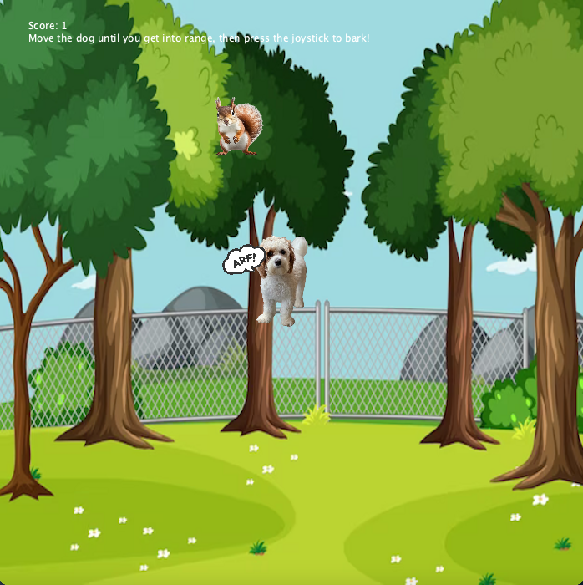
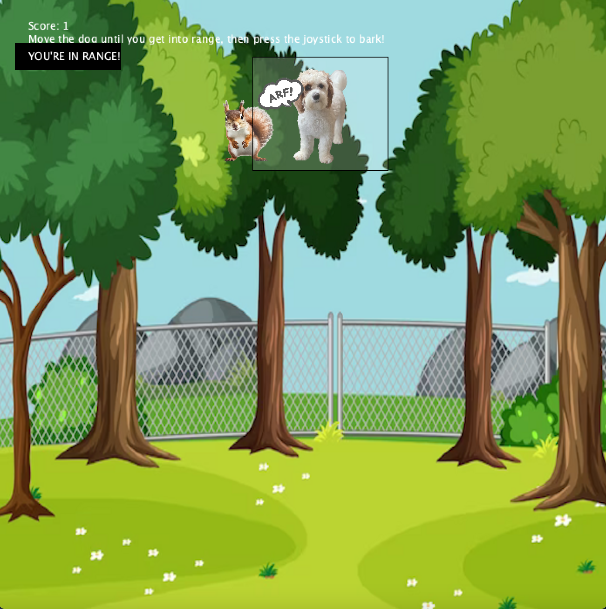
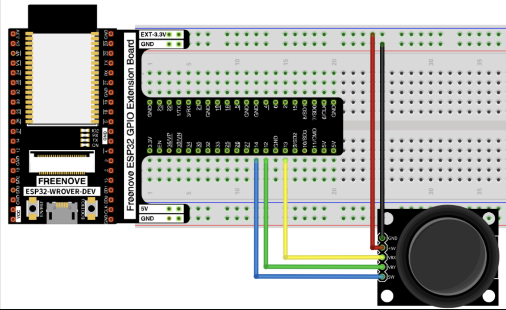

# Module 02: Interactive Devices

  

# Overview
**Goals** 
1. Create an interactive device with provided hardware using wired power to send data to a laptop for some form of media generation.
2. Think about an aesthetic and usable enclosure design to house the specified components and the ESP32. 
3. Continue building comfort in the idea of art as a subjective media 

**Hardware Components**
1. ESP32 TTGO T-display
2. Joystick
3. 5 male-to-female wires
4. Breadboard

**Enclosure/Installation Components**
1. Box enclosure of your choice 
3. USB-C cable

# Installing software
1. [Install Arduino application here.](https://www.arduino.cc/en/software). 
  Note: For RAM related errors when running arduino files, follow the instructions [here](https://github.com/Xinyuan-LilyGO/TTGO-T-Display) to install a very sketchy driver that will miraculously fix those issues.
2. [Install Processing IDE compatible with your device.](https://processing.org/download/)

# Setting up Arduino environment
1. Add the ESP32 board to Arduino in the Boards Manager tab by adding [this](https://dl.espressif.com/dl/package_esp32_index.json)
2. Search for and install the TFT_eSPI library in the Tools -> Library Manager tab.
3. If using an ESP32 device without preloaded support, update the User_Setup_Select.h header file by navigating to {your path here}/Arduino/libraries/TFT_eSPI/User_Setup_Select.h and comment out #include <User_Setup.h> and uncomment #include <User_Setups/Setup25_TTGO_T_Display.h>

# Hardware Setup
1. Solder header pins to ESP32.
2. Put ESP32 into breadboard
3. Connect joystick to device according to the following circuit schematic:
   

   Connections (These connections I used differ from the above diagram):
   - Joystick GND (ground) pin -> ESP32 G pin
   - Joystick +5V pin -> ESP32 3V pin
   - Joystick VRX pin -> ESP32 33 pin
   - Joystick VRY pin -> ESP32 25 pin
   - Joystick SW pin -> ESP32 26 pin
  Note: If you change the pins for VRX or VRY, ensure you choose pins which accept analog (ADC) input.

# Putting it all together 
1. Connect ESP32 and laptop with USB-C cable
2. Run dog_vs_squirrel.ino in Arduino to upload the program to the ESP32 device
3. Run dog_vs_squirrel.pde in Processing to run the program on your laptop. (Note: if you encounter a port issue, check to make sure the Serial Monitor is closed in Arduino and run again).
4. Place hardware into enclosure of choice, ensuring any wired connections remain stable and supported and the USB-C cable can leave to connect to laptop. 

