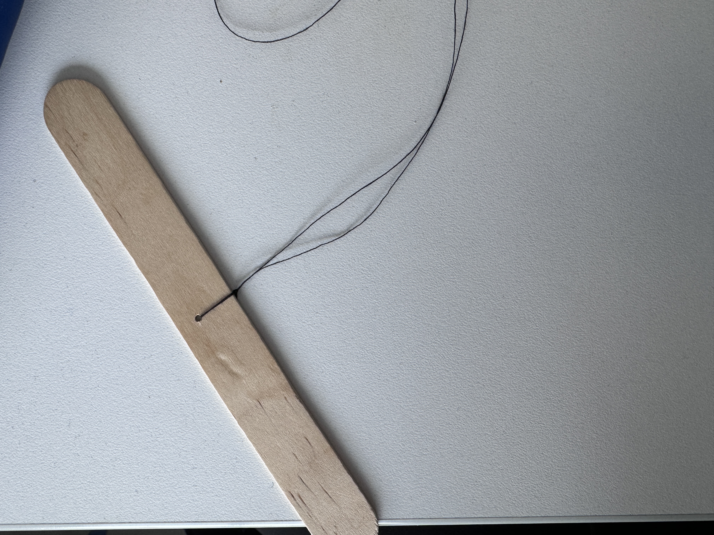

# Module 01: Generative Art
Goals: 
1. Introduction to the world of working with an underspecified problem and writing code that is creatively driven rather than driven by specifications.
2. Become comfortable with the art world in a low stakes way.
   

# Installing software
1. [Install Arduino application here.](https://www.arduino.cc/en/software). 
  Note: For RAM related errors when running arduino files, follow the instructions [here](https://github.com/Xinyuan-LilyGO/TTGO-T-Display) to install a very sketchy driver that will miraculously fix those issues. 

# Setting up Arduino environment
1. Add the ESP32 board to Arduino in the Boards Manager tab by adding [this](https://dl.espressif.com/dl/package_esp32_index.json)
2. Search for and install the TFT_eSPI library in the Tools -> Library Manager tab.
3. If using an ESP32 device without preloaded support, update the User_Setup_Select.h header file by navigating to {your path here}/Arduino/libraries/TFT_eSPI/User_Setup_Select.h and comment out #include <User_Setup.h> and uncomment #include <User_Setups/Setup25_TTGO_T_Display.h>

# Uploading code to device 
1. Open file in Arduino app and select board (TTGO T1) and correct port.
2. Plug ESP32 device into computer using a USB-C cable and click upload in Arduino. 
   Note: if the port doesn't show up, try flipping the cord and plugging in again as your cable might not have all the necessary connections on both sides

# Prepping Battery
1. Solder battery's power and ground cables to JST connectors.
2.  Cut small pieces of heatshrink tubing to cover exposed wires and melt down with industrial grade blow dryer (this is to ensure power and ground cables don't touch when plugged in).
   
   
   
3. Connect ESP32 with uploaded code to battery.

   

# Installation 
1. Decorate enclosure as desired.
2. Using a drill press, drill hole into a wide popsicle stick.

    
3. Fold a long piece of durable string or thread in half, thread the folded side through the hole in the popsicle stick.
4. Create holes in the enclosure and thread for hanging.

   
5. Use tape to secure the ESP32 and connected battery inside the enclosure.

   
   
6. Thread the other end(s) of the string through hole(s) in the enclosure and tie.
7. Hang installation. (In this case, rested popsicle stick in slats in ceiling to hang device enclosure).

    

